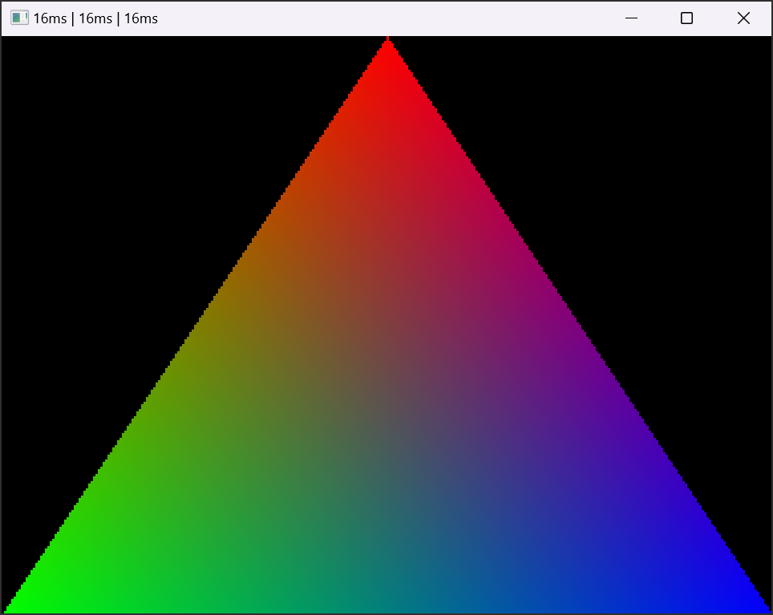

# pix16

A fantasy console written in C from scratch.



## Getting Started

### Windows

Install `cl.exe` from Microsoft Visual Studio Community Edition (recommended version: [2019](https://visualstudio.microsoft.com/vs/older-downloads/)).
Go through the install flow and install `C++ compiler tools`.

Then, in a Command Prompt run the following script:

```batch
"C:\Program Files (x86)\Microsoft Visual Studio\2019\Community\VC\Auxiliary\Build\vcvarsall.bat" x64
```

This will set up the environment variables to compile for x64 devices (for this session only).

Now you should be able to run `build.bat` in the project root.

### MacOS

Install SDL2:

```bash
brew install sdl2
```

## Building

### Windows

To build the project run:

```batch
.\build.bat
```

This will create a debug build in the `build` directory.

### MacOS

To build the project run:
```bash
./build.sh
```

This will create a debug build in the `build` directory.

## Release Builds

### Windows

To build the project for release, run:

```batch
dist.bat
```

This will create a release build in the `build` directory and a distributable `pix16_win32.zip` file.


## Other Platforms

The project has only been set up for Windows and MacOS so far. Linux is in theory possible with the SDL2 backend, but some changes to the build script would need to happen.

## TODO

- have some way to load non-monospaced fonts
- transparency
- see if we need to blend transparency in linear rgb

- more robust audio mixing (we only support 8 concurrent sounds at the moment)
- async audio API

